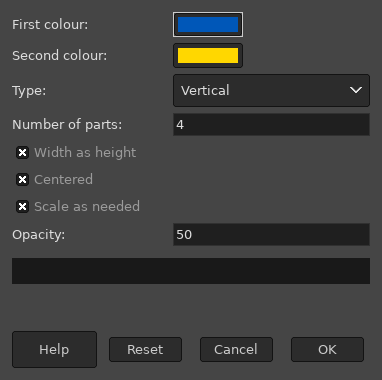

# MHL-Ruler
This Script-Fu create a proportionally divided ruler from the selection.

## INSTALLATION
Place the script file (mhl-ruler.scm) in to the Gimp scripts directory. You can find it in the preferences.
> Edit -> Preferences -> Folders -> Scripts

