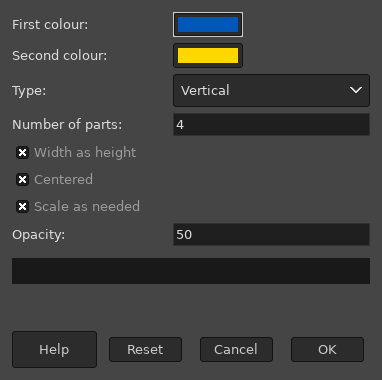
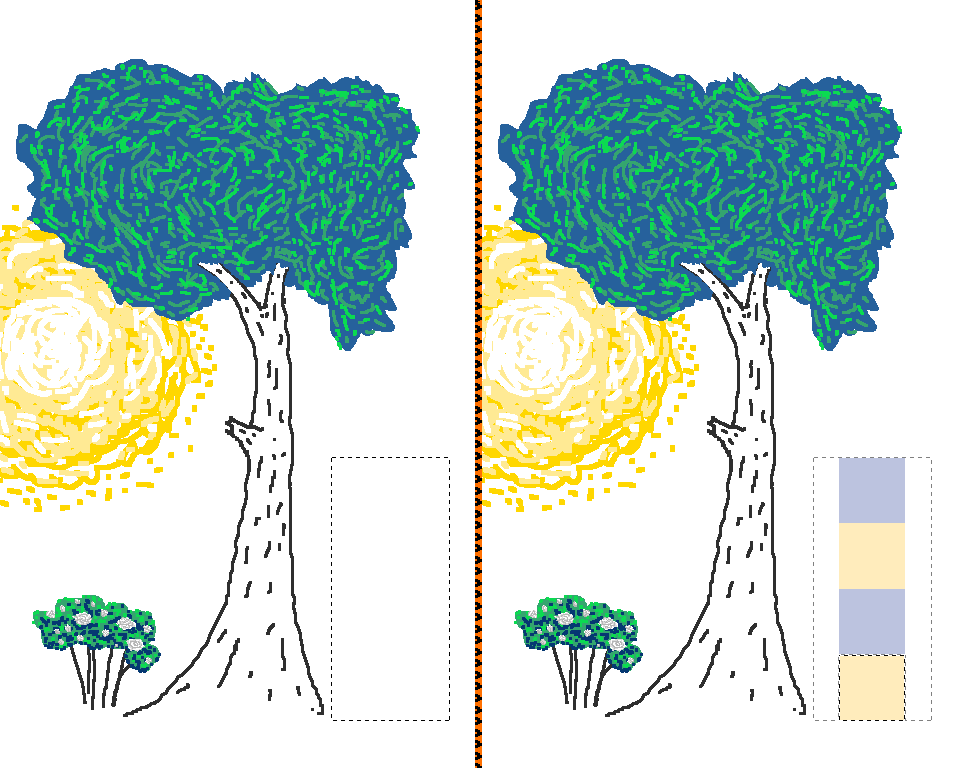

# MHL-Ruler
MHL-Ruler is a Script-Fu plug-in for GIMP 3.x that creates a proportionally
divided ruler from the current selection.

It generates a layer group containing evenly divided sections, which can be
used for composition guides, proportions, measurements, etc.

## INSTALLATION
Copy `mhl-ruler.scm` to your GIMP scripts folder and restart GIMP.

> [!TIP]
> You can find the script folders in GIMP preferences:
>
> Edit -> Preferences -> Folders -> Scripts

## USAGE
Open an image and create a selection, then run:

> Filters -> MHL -> Ruler

Adjust the settings as needed and confirm.

## GIMP 2 (Legacy)

The previous version for GIMP 2.x is available in the
`gimp2-legacy/` directory.
